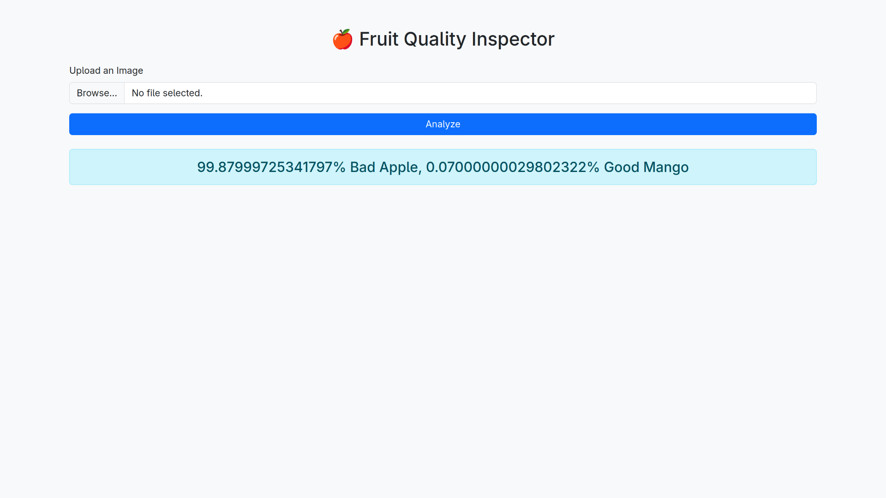
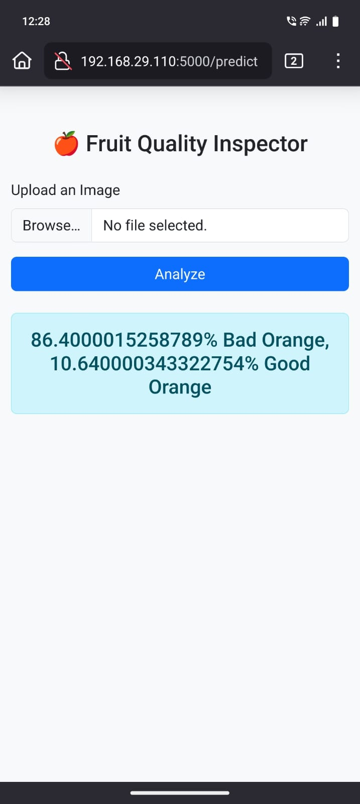

# 🍓 Fruit Quality Classifier Web App (TFLite)

This web app uses a **TensorFlow Lite (TFLite)** model to identify both the **type of fruit** and its **quality** — whether it's **Good (fresh)** or **Bad (rotten)**.
---

## 🚀 Features

- 🧠 Classifies **fruit type** (e.g., Apple, Mango, Banana)
- ✅ Predicts **quality**: Good or Bad
- ⚡ Built using Flask, BootstrapCSS, and TensorFlow Lite
- 📤 Upload image files via camera or files
- 🔍 Displays prediction with confidence percentage

---

## 🛠️ Tech Stack

- **Python 3.10**
- **Flask** – Backend server
- **TensorFlow Lite** – Lightweight ML model
- **HTML + BootstrapCSS** – Clean frontend
- **JavaScript** – UI logic

---

## 🧠 Model Details

- Model: `model.tflite`
- Labels: Stored in `labels.txt`
- Predicts:
  - Fruit name: e.g., Mango, Apple, Orange
  - Quality: Good or Bad
- Format: Lightweight and fast, suitable for mobile/web
- Framework: TensorFlow Lite

---

## 📁 Folder Structure

<pre>
fruit-classifier/
├── static/
│   └── bootstrap/
│       ├── css
|       |   └── bootstrap.min.css
│       └── js
|           └── bootstrap.bundle.min.js
│   
├── templates/
│   └── index.html
├── model/
│   ├── model.tflite
│   └── labels.txt
├── app.py
├── requirements.txt
├── README.md
└── LICENSE
</pre>

---

## 📸 App Interface





## 🧪 Run Locally

---

## 🛠️ Installation

```bash
git clone https://github.com/daksheshsharma2409/fruit-classifier.git
cd fruit-classifier
pip install -r requirements.txt
python app.py
```
---

## 🧪 Use Instructions

### After Running app.py

- on your device go to http://localhost:5000
- for other devices connected to the same wifi go to device-ip:5000

---

## 👨‍💻 Author

**Made with ❤️ by Dakshesh Sharma**  
[GitHub Profile](https://github.com/daksheshsharma2409)

---

## 📜 License

This project is licensed under the **MIT License**.  
See the [LICENSE](LICENSE) file for more details.

---

